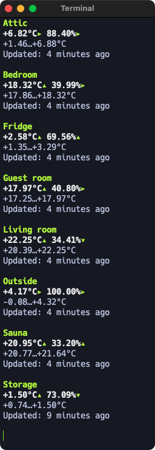

Ruuvi terminal client
=====================

A custom terminal Ruuvi client that uses curses to display Ruuvi sensor data. Use Q to safely exit the app.

The app will ask for API URL and API type when starting for the first time. It will save config to `~/.config/ruuvi-terminal-client/config.yml` or `~/Library/Application Support/ruuvi-terminal-client/config.yml` depending if you are using Linux or macOS.

There are currently two supported API types:

- `ruuvi_gateway`: Using /history endpont of Ruuvi Gateway's REST API.
- `ruuvi_custom_api`: My personal custom API (https://github.com/joonaskokko/ruuvi-api) for my own use mostly.

Might add Ruuvi Cloud at some point but eh. Needs authentication and all extra logic.

Tested on macOS and Linux.

Compiling
---------
`$ cargo build --release`

Running
-------
`$ cargo run --release`
